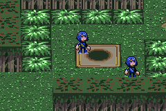

# sp3d

This repo is a demo that illustrates a method for creating pseudo-3d graphics on the GBA, heavily inspired by the game Sonic Battle. It uses [Butano](https://github.com/GValiente/butano) which handles most of the low-level business.

This code is largely based off of my team's [GBA Jam 2024](https://itch.io/jam/gbajam24) entry, [Sleep Paradox](https://staticlinkage.itch.io/sleep-paradox) - hence the name.

## Credits

I probably never would have been able to figure all this out without discovering this [Sonic Battle (GBA) Renderer Series](https://fouramgames.com/blog/sonic-battle-renderer) by 4AM Games. They also have a demo written for PC/web: https://github.com/Ohmnivore/battle.

## Re: math

The math involved here relies a lot on core 3D concepts like vectors/matrices, but doesn't go much further than that. If you're looking to learn about those, I recommend [https://gamemath.com/](https://gamemath.com/).

3D math is not my strongest point, and as such there are probably some mistakes/kludges in this code. Most notably is that the camera calculations only ever really work when it is positioned 1 unit away from its target using pitch/heading values. If you try to place the camera in an arbitrary position and have it track its target, the whole thing breaks.

## Developer notes

### Co-ordinate space

The demo uses an XYZ co-ordinate space where X is left/right, Y is forward/backward (i.e. moving further/closer into the scene), and Z is moving up/down (i.e. jumping would involve travelling along the Z axis). This makes it easier to map between 2D/3D, since an X-Y position in 3D space maps to the same X-Y co-ordinates in 2D space.

We also keep the positive/negative axes consistent with Butano's co-ordinate system, i.e. (0, 0, 0) is always the center of the scene, and moving in the positive Y direction will move you closer to the default camera position.

### Scene composition

A pseudo-3d scene is composed of:

- Two affine tilemaps, one each for floor/ceiling. The ceiling tilemap is offset slightly higher, which creates the illusion of perspective. Since the GBA only supports two affine tilemaps at a time, this takes up your entire tilemap allocation for as long as they are both on screen.
- 32x32 Affine sprites for walls, always aligned to either the XZ or YZ plane (this demo doesn't support arbitrary wall angles).
- Regular sprites for characters/objects.

### Wall generation

Probably the hardest problem to solve is actually figuring out how to place walls in your scene, because it will probably vary a lot depending on how your game is set up. You could potentially place walls manually if your level editor allows it, or auto-generate them from your level data. In this example, we scan through the ceiling tilemap to find edges and place walls there automatically.

It takes quite a bit of storage to hold enough wall objects for the entire scene. There are probably some creative ways you could optimise this away, but in Sleep Paradox it wasn't too much of an issue.

### Sprite sorting layers

We use sprite sorting layers to ensure that sprites closer to the screen show on top of sprites that are further away, but this requires a lot more layers than Butano provides by default (see the Makefile for `-DBN_CFG_SPRITES_MAX_SORT_LAYERS=64`). This may have performance implications when used in a real game, so you may need to optimise to keep the number down, e.g. by reducing the number of sprites on screen, probably walls.